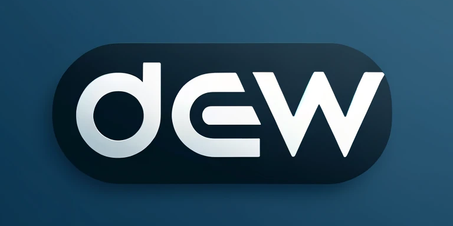
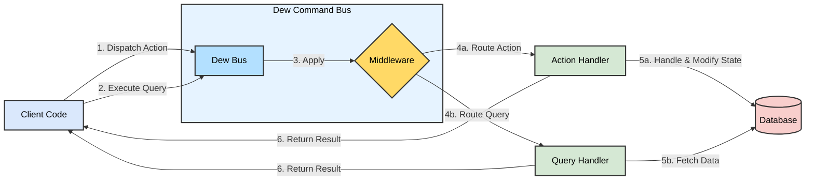

<h1>Dew: A Lightweight, Pragmatic Command Bus Library with Middleware System for Go</h1>

[](https://pkg.go.dev/github.com/go-dew/dew)
[](https://goreportcard.com/report/github.com/go-dew/dew)
[](https://codecov.io/gh/go-dew/dew)



Dew streamlines Go application development by providing a unified interface for handling operations and domain logic. It offers a lightweight command bus with an integrated middleware system, simplifying complex workflows and promoting clean, maintainable code architecture.

<h2>Table of Contents</h2>

- [Features](#features)
- [Concept Diagram](#concept-diagram)
- [Motivation](#motivation)
- [Terminology](#terminology)
- [Convention for Actions and Queries](#convention-for-actions-and-queries)
  - [Example for `Action`:](#example-for-action)
  - [Example for `Query`:](#example-for-query)
- [Installation](#installation)
- [Example](#example)
  - [Hello Action Example](#hello-action-example)
  - [Hello Query Example](#hello-query-example)
- [Usage](#usage)
  - [Setting Up the Bus](#setting-up-the-bus)
  - [Dispatching Actions](#dispatching-actions)
  - [Executing Queries](#executing-queries)
  - [Asynchronous Queries](#asynchronous-queries)
  - [Middleware](#middleware)
    - [Transaction Middleware Example](#transaction-middleware-example)
  - [Grouping Handlers and Applying Middleware](#grouping-handlers-and-applying-middleware)
- [Testing](#testing)
- [Benchmarks](#benchmarks)
- [Contributing](#contributing)
- [License](#license)

## Features

- **Lightweight**: Clocks around 450 LOC with minimalistic design.
- **Pragmatic and Ergonomic**: Focused on developer experience and productivity.
- **Production Ready**: 100% test coverage.
- **Zero Dependencies**: No external dependencies.
- **Fast**: See [benchmarks](#benchmarks).

## Concept Diagram

The following diagram illustrates the core concepts and flow of Dew:



## Motivation

Working on multiple complex backend applications in Go over the years, I've been seeking ways to enhance code readability, maintainability, and developer enjoyment. The Command Bus architecture emerged as a promising solution to these challenges. However, unable to find a library that met all my requirements, I created Dew.

Dew is designed to be lightweight and dependency-free, facilitating easy integration into any Go project. It implements the [command-oriented interface](https://martinfowler.com/bliki/CommandOrientedInterface.html) pattern, promoting separation of concerns, modularization, and improved code readability while reducing cognitive load.

## Terminology

Dew uses four key concepts:

1. **Action**: An operation that changes the application state. Similar to a "Command" in CQRS patterns.
2. **Query**: An operation that retrieves data without modifying the application state.
3. **Middleware**: A function that processes Actions and Queries before and/or after they are handled. Used for cross-cutting concerns like logging, authorization, or transactions.
4. **Bus**: The central component that manages Actions, Queries, and Middleware. It routes operations to their appropriate handlers.

## Convention for Actions and Queries

Dew follows these conventions for `Action` and `Query` interfaces:

- **Action Interface**: Each action must implement a `Validate` method to ensure the action's data is valid before processing.
- **Query Interface**: Each query implements the `Query` interface, which is an empty interface. Queries don't require a `Validate` method as they don't modify application state.

### Example for `Action`:

```go
// MyAction represents an Action
type MyAction struct {
    Amount int
}

// Validate implements the Action interface
func (a *MyAction) Validate(ctx context.Context) error {
    if a.Amount <= 0 {
        return fmt.Errorf("amount must be greater than zero")
    }
    return nil
}

```

### Example for `Query`:

```go

// MyQuery represents a Query
type MyQuery struct {
    AccountID string
}

// MyQuery doesn't need a Validate method as it doesn't change state
```

## Installation

```bash
go get github.com/go-dew/dew
```

## Example

See [examples](examples) for more detailed examples.

### Hello Action Example

```go
package main

import (
    "context"
    "fmt"
    "github.com/go-dew/dew"
)

// HelloAction is a simple action that greets the user.
type HelloAction struct {
    Name string
}

// Validate checks if the name is valid.
func (c HelloAction) Validate(_ context.Context) error {
    if c.Name == "" {
        return fmt.Errorf("invalid name")
    }
    return nil
}

func main() {
    // Initialize the Command Bus.
    bus := dew.New()

    // Register the handler for the HelloAction.
    bus.Register(new(HelloHandler))

    // Create a context with the bus.
    ctx := dew.NewContext(context.Background(), bus)

    // Dispatch the action.
    result, err := dew.Dispatch(ctx, &HelloAction{Name: "Dew"})
    if err != nil {
        fmt.Println("Error:", err)
    } else {
        fmt.Printf("Result: %+v\n", result)
    }
}

type HelloHandler struct {}
func (h *HelloHandler) HandleHelloAction(ctx context.Context, cmd *HelloAction) error {
    fmt.Printf("Hello, %s!\n", cmd.Name) // Output: Hello, Dew!
    return nil
}
```

### Hello Query Example

```go
package main

import (
    "context"
    "fmt"
    "github.com/go-dew/dew"
)

// HelloQuery is a simple query that returns a greeting message.
type HelloQuery struct {
    // Name is the name of the user.
    Name string

    // Result is the output of the query.
    // You can define any struct as the result.
    Result string
}

func main() {
    // Initialize the Command Bus.
    bus := dew.New()

    // Register the handler for the HelloAction.
    bus.Register(new(HelloHandler))

    // Create a context with the bus.
    ctx := dew.NewContext(context.Background(), bus)

    // Execute the query.
    result, err := dew.Query(ctx, &HelloQuery{Name: "Dew"})
    if err != nil {
        fmt.Println("Error:", err)
    } else {
        fmt.Printf("Result: %+v\n", result)
    }
}

type HelloHandler struct {}
func (h *HelloHandler) HandleHelloQuery(ctx context.Context, cmd *HelloQuery) error {
    cmd.Result = fmt.Sprintf("Hello, %s!", cmd.Name)
    return nil
}
```

## Usage

### Setting Up the Bus

Create a bus and register handlers:

```go
bus := dew.New()
bus.Register(new(MyHandler))
```

### Dispatching Actions

Use the `Dispatch` function to send actions:

```go
ctx := dew.NewContext(context.Background(), bus)
result, err := dew.Dispatch(ctx, &MyAction{Message: "Hello, Dew!"})
if err != nil {
    fmt.Println("Error dispatching action:", err)
} else {
    fmt.Printf("Action result: %+v\n", result)
}
```

### Executing Queries

Use the `Query` function to execute queries:

```go
ctx := dew.NewContext(context.Background(), bus)
result, err := dew.Query(ctx, &MyQuery{Question: "What is Dew?"})
if err != nil {
    fmt.Println("Error executing query:", err)
} else {
    fmt.Printf("Query result: %+v\n", result)
}
```

### Asynchronous Queries

Use `QueryAsync` for handling multiple queries concurrently:

```go
ctx := dew.NewContext(context.Background(), bus)
accountQuery := &AccountQuery{AccountID: "12345"}
weatherQuery := &WeatherQuery{City: "New York"}

err := dew.QueryAsync(ctx, dew.NewQuery(accountQuery), dew.NewQuery(weatherQuery))
if err != nil {
    fmt.Println("Error executing queries:", err)
} else {
    fmt.Println("Account Balance for ID 12345:", accountQuery.Result)
    fmt.Println("Weather in New York:", weatherQuery.Result)
}
```

### Middleware

Middleware can be used to execute logic before and after command or query execution:

```go
func loggingMiddleware(next dew.Middleware) dew.Middleware {
    return dew.MiddlewareFunc(func(ctx dew.Context) error {
        fmt.Println("Before executing command")
        err := next.Handle(ctx)
        fmt.Println("After executing command")
        return err
    })
}

func main() {
    bus := dew.New()
    bus.Use(dew.ACTION, loggingMiddleware)
    bus.Register(new(MyCommandHandler))
}
```

#### Transaction Middleware Example

Here's an example of a middleware that manages database transactions:

```go
package main

import (
    "context"
    "fmt"
    "github.com/go-dew/dew"
    "database/sql"
)

// TransactionalMiddleware creates a middleware for handling transactions
func TransactionalMiddleware(db *sql.DB) func(next dew.Middleware) dew.Middleware {
    return func(next dew.Middleware) dew.Middleware {
        return dew.MiddlewareFunc(func(ctx dew.Context) error {
            // Check if a transaction is already present in the context
            if tx, ok := ctx.Context().Value("tx").(*sql.Tx); ok && tx != nil {
                // Transaction already exists, proceed without creating a new one
                return next.Handle(ctx)
            }

            // Start a new transaction
            tx, err := db.BeginTx(ctx.Context(), nil)
            if err != nil {
                return fmt.Errorf("failed to begin transaction: %w", err)
            }

            // Attach the transaction to the context
            txCtx := context.WithValue(ctx.Context(), "tx", tx)
            ctx = ctx.WithContext(txCtx)

            // Execute the command
            err = next.Handle(ctx)
            if err != nil {
                // Roll back the transaction in case of an error
                if rbErr := tx.Rollback(); rbErr != nil {
                    return fmt.Errorf("rollback failed: %w", rbErr)
                }
                return err
            }

            // Commit the transaction if everything went well
            if commitErr := tx.Commit(); commitErr != nil {
                return fmt.Errorf("commit failed: %w", commitErr)
            }

            return nil
        })
    }
}

func main() {
    db, err := sql.Open("driver-name", "database-url")
    if err != nil {
        panic("failed to connect database")
    }
    defer db.Close()

    bus := dew.New()
    bus.UseDispatch(TransactionalMiddleware(db))

    // Register your handlers and continue with application setup
}
```

This middleware example demonstrates how to:

1. Start a new database transaction before executing a command.
2. Attach the transaction to the context for use in handlers.
3. Commit the transaction if the command executes successfully.
4. Roll back the transaction if an error occurs during command execution.

This pattern is particularly useful for ensuring data consistency across multiple database operations within a single command.

### Grouping Handlers and Applying Middleware

Group handlers and apply middleware to a subset of handlers:

```go
func main() {
    bus := dew.New()
    bus.Group(func(bus dew.Bus) {
        bus.Use(dew.ACTION, middleware.Transaction)
        bus.Use(dew.ALL, middleware.Logger)
        bus.Register(new(UserProfileHandler))

        bus.Group(func(g dew.Bus) {
            bus.Use(dew.ACTION, middleware.Tracing)
            bus.Register(new(SensitiveHandler))
        })
    })
}
```

## Testing

Testing with Dew is straightforward. You can create mock handlers and use them in your tests. Here's an example:

```go
package example_test

import (
    "context"
    "github.com/go-dew/dew"
    "github.com/your/application/internal/action"
    "testing"
)

func TestCreateUser(t *testing.T) {
    // Create a new bus instance
    bus := dew.New()

    // Create a mock handler
    mockHandler := &MockCreateUserHandler{
        t: t,
        expectedName: "John Doe",
        expectedEmail: "john@example.com",
    }

    // Register the mock handler
    bus.Register(mockHandler)

    // Create a context with the bus
    ctx := dew.NewContext(context.Background(), bus)

    // Create the action
    createUserAction := &action.CreateUserAction{
        Name:  "John Doe",
        Email: "john@example.com",
    }

    // Dispatch the action
    _, err := dew.Dispatch(ctx, createUserAction)

    // Check for errors
    if err != nil {
        t.Fatalf("Expected no error, got %v", err)
    }

    // Check if the mock handler was called
    if !mockHandler.called {
        t.Fatalf("Expected mock handler to be called")
    }
}

type MockCreateUserHandler struct {
    t             *testing.T
    expectedName  string
    expectedEmail string
    called        bool
}

func (m *MockCreateUserHandler) HandleCreateUserAction(ctx context.Context, action *action.CreateUserAction) error {
    m.called = true
    if action.Name != m.expectedName {
        m.t.Errorf("Expected name %s, got %s", m.expectedName, action.Name)
    }
    if action.Email != m.expectedEmail {
        m.t.Errorf("Expected email %s, got %s", m.expectedEmail, action.Email)
    }
    return nil
}
```

This example demonstrates how to:

1. Create a mock bus and handler for testing.
2. Register the mock handler with the bus.
3. Create and dispatch an action.
4. Verify that the action was handled correctly by the mock handler.

You can extend this pattern to test various scenarios, including error cases and different types of actions and queries.

## Benchmarks

Results as of May 23, 2024 with Go 1.22.2 on darwin/arm64

```
BenchmarkMux/query-12                          3012015               393.5 ns/op           168 B/op          7 allocs/op
BenchmarkMux/dispatch-12                       2854291               419.1 ns/op           192 B/op          8 allocs/op
BenchmarkMux/query-with-middleware-12          2981778               407.8 ns/op           168 B/op          7 allocs/op
BenchmarkMux/dispatch-with-middleware-12       2699398               446.8 ns/op           192 B/op          8 allocs/op
```

## Contributing

We welcome contributions to Dew! Please see the [contribution guide](CONTRIBUTING.md) for more information.

## License

Licensed under [MIT License](https://github.com/go-dew/dew/blob/main/LICENSE)