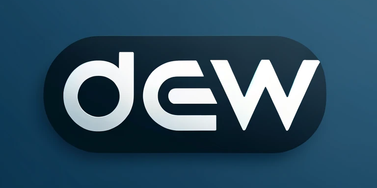

.. Dew documentation master file, created by
   sphinx-quickstart on Mon May 20 13:15:24 2024.
   You can adapt this file completely to your liking, but it should at least
   contain the root `toctree` directive.

Welcome to Dew's documentation!
===============================

A Lightweight, Flexible, and Robust Command Bus library for Go.

Features
--------

.. list-table::
   :widths: 25 25
   :header-rows: 1

   * - Feature
     - Description
   * - 🚀 Lightweight
     - Clocks around 600 LOC.
   * - 📦 Minimal
     - Zero dependencies.
   * - 🌹 Practical
     - Built-in support for middleware, grouping handlers, and asynchronous queries.
   * - ⚓️ Production Ready
     - 100% test coverage.

:doc:`introduction`
   What Dew is and what it can do for you.

:doc:`quickstart`
   A quick start guide to get you up and running.

:doc:`middleware`
   How to develop and use middleware.

:doc:`testing`
   How to write tests for your application.

.. toctree::
   :caption: Introduction
   :hidden

   introduction

.. toctree::
   :caption: Quickstart
   :hidden

   quickstart

.. toctree::
   :caption: Middleware
   :hidden

   middleware

Links
------

- `GitHub <https://github.com/go-dew/dew>`_
- `GoDoc <https://pkg.go.dev/github.com/go-dew/dew>`_
